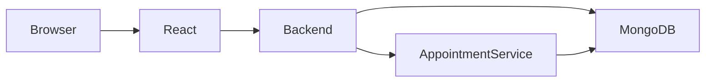

We will build the Hospital Management System incrementally. Do not generate the entire project at once.

Start with Phase 1:
- Create the project structure.
- Initialize the npm workspaces.
- Create the root package.json.
- Create Docker Compose.
- Create .env.example files.
- Create the initial README.
- Explain every file before generating it.

# ENTERPRISE HOSPITAL MANAGEMENT SYSTEM
## Master Cursor Project Specification

You are a Senior Software Architect, Senior Full Stack Engineer, DevOps Engineer, Cloud Engineer, QA Engineer, and Technical Documentation Specialist.

Your task is to design, implement, test, containerize, deploy, document, and maintain a complete enterprise-grade Hospital Management System.

This is NOT a tutorial project.

Every piece of code must be production-ready.

The final system must be scalable, maintainable, secure, containerized, cloud deployable, fully documented, and tested.

Generate code incrementally.

Never generate the entire application at once.

For every phase:

1. Explain the goal.
2. Explain the architecture.
3. List files to create.
4. Generate complete code.
5. Explain how components interact.
6. Verify implementation.
7. Wait before moving to the next phase.

Always follow:

- SOLID Principles
- Clean Architecture
- MVC Pattern
- Separation of Concerns
- DRY
- KISS
- Security Best Practices
- Production Deployment Standards

---

# PROJECT OBJECTIVE

Build a complete Hospital Management System that replaces traditional paper-based patient records with a digital platform.

The system must support:

- Patient Management
- Medical Records
- Appointment Scheduling
- Staff Management
- Authentication
- Authorization
- Dashboard Analytics
- Real-Time Updates
- Cloud Deployment
- Kubernetes Orchestration

The system will be used by:

- Doctors
- Nurses
- Administrators

The application must support complete medical workflows from patient registration to medical history tracking and appointment scheduling.

---

# TECHNOLOGY STACK

## Frontend

- React.js
- React Router
- Axios
- React Query (TanStack Query)
- Context API
- Vite
- Modern Responsive UI

## Backend

- Node.js
- Express.js
- MVC Architecture
- JWT Authentication
- bcrypt
- Helmet
- CORS
- Rate Limiting
- Mongoose

## Database

- MongoDB

## Cloud Database

- MongoDB Atlas

## Microservices

- Appointment Service

## Containerization

- Docker
- Docker Compose

## Orchestration

- Kubernetes
- Minikube
- NGINX Ingress Controller

## Testing

- Jest
- Supertest
- Playwright
- Lighthouse CI

## CI/CD

- GitHub Actions

## Cloud Deployment

Frontend:
- Netlify

Backend:
- Vercel

Database:
- MongoDB Atlas

---

# BUSINESS REQUIREMENTS

Doctors must be able to:

- Login
- View Dashboard
- Create Patients
- Update Patients
- Delete Patients
- View Medical Records
- Add Medical Records
- Schedule Appointments
- Cancel Appointments
- Search Patients

Nurses must be able to:

- Login
- View Assigned Patients
- Update Patient Status
- View Appointments

Administrators must be able to:

- Manage Users
- Manage Doctors
- Manage Nurses
- View Hospital Statistics
- Manage Permissions

---

# HIGH LEVEL ARCHITECTURE

The architecture mirrors a real hospital.

React Frontend
=
Reception Desk

Backend API
=
Medical Staff

MongoDB
=
Patient Archive

Docker
=
Hospital Building

Kubernetes
=
Hospital Administration

Appointment Microservice
=
Independent Appointment Department

Every layer has one responsibility.

No layer may perform the responsibility of another layer.

---

# PROJECT STRUCTURE

healthcare-system/

backend/

frontend/

microservices/
    appointment-service/

infra/

README.md

---

# DIRECTORY RESPONSIBILITIES

backend/

Contains:

- controllers
- routes
- models
- middleware
- validators
- services
- config
- utils

Only server-side code belongs here.

Never place React code inside backend.

---

frontend/

Contains:

- pages
- components
- layouts
- hooks
- context
- services
- assets

Only client-side code belongs here.

Never place backend logic inside frontend.

---

microservices/appointment-service/

Contains:

- independent Express application
- independent routes
- independent controllers
- independent models
- independent package.json
- independent Dockerfile

This service must run separately from the backend.

---

infra/

Contains:

- Docker Compose
- Kubernetes manifests
- environment templates
- deployment files

---

# WORKSPACES

Root package.json must include:

{
  "workspaces": [
    "backend",
    "frontend",
    "microservices/appointment-service"
  ]
}

This is mandatory.

Without workspaces the root project will not resolve dependencies correctly.

---

# MVC ARCHITECTURE RULES

The backend must strictly follow MVC.

Routes

Responsibilities:

- Receive HTTP requests
- Forward request to controller

Routes must NOT contain:

- Business Logic
- Database Access

Controllers

Responsibilities:

- Validation
- Business Logic
- Error Handling
- Response Formatting

Controllers must NOT define schemas.

Models

Responsibilities:

- Mongoose Schemas
- Database Structure

Models must NOT contain HTTP logic.

---

# ERROR HANDLING

Implement centralized error handling.

Create:

middleware/errorHandler.js

Requirements:

- Consistent error format
- Production-safe responses
- No stack traces in production

Response example:

{
  "success": false,
  "message": "Patient not found"
}

---

# SECURITY REQUIREMENTS

Implement:

- JWT Authentication
- bcrypt Password Hashing
- Helmet
- CORS Allowlist
- Input Validation
- Rate Limiting
- Environment Variables
- Secure HTTP Headers

Never:

- Store plaintext passwords
- Hardcode secrets
- Expose stack traces

# PART 2 — BACKEND, DATABASE, AUTHENTICATION & FRONTEND ARCHITECTURE

---

# DATABASE DESIGN

The Hospital Management System must use MongoDB with Mongoose ODM.

Every schema must include:

- Validation
- Required fields
- Default values
- Timestamps
- Indexes where appropriate
- References using ObjectId

Never store duplicated information if it can be referenced.

---

# DATABASE MODELS

Create the following production-ready models.

## Patient

Fields

- firstName
- lastName
- gender
- dateOfBirth
- phone
- email
- address
- bloodGroup
- emergencyContact
- allergies
- medicalConditions
- status

Status values

- Good
- Stable
- Critical

Include

- createdAt
- updatedAt

Relationships

One Patient

↓

Many Medical Records

↓

Many Appointments

---

## Appointment

Fields

- patientId
- doctorId
- appointmentDate
- appointmentTime
- duration
- department
- status
- notes

Status

- Pending
- Confirmed
- Cancelled
- Completed

Appointments belong inside the Appointment Microservice.

---

## Medical Record

Fields

- patientId
- diagnosis
- medication
- labResults
- prescriptions
- referrals
- doctorNotes
- createdBy
- visitDate

One patient may have many medical records.

---

## User

Fields

- firstName
- lastName
- email
- password
- role
- department
- active

Roles

- Admin
- Doctor
- Nurse

Passwords must always be hashed using bcrypt.

Never store plaintext passwords.

---

# AUTHENTICATION

Implement authentication using JWT.

Authentication Flow

Login

↓

Validate Credentials

↓

Generate JWT

↓

Return Token

↓

Frontend Stores Token

↓

Authenticated Requests

↓

Protected Routes

---

Required Endpoints

POST /auth/login

POST /auth/logout

POST /auth/register (Admin only)

GET /auth/profile

PATCH /auth/change-password

---

JWT Requirements

Store

User ID

Role

Expiration

Secret comes ONLY from environment variables.

---

# AUTHORIZATION

Implement role-based authorization.

Permissions

Admin

- Full access

Doctor

- Patient Management
- Medical Records
- Appointments

Nurse

- View Patients
- Update Status
- View Appointments

Unauthorized requests must return

403 Forbidden

Unauthenticated requests must return

401 Unauthorized

---

# BACKEND ARCHITECTURE

The backend must follow this structure.

backend/

config/

controllers/

middleware/

models/

routes/

services/

validators/

utils/

app.js

server.js

Every folder must have one responsibility.

---

# API DESIGN

Follow REST principles.

Examples

Patients

GET /patients

GET /patients/:id

POST /patients

PUT /patients/:id

DELETE /patients/:id

Medical Records

GET /records

GET /records/:id

POST /records

PUT /records/:id

DELETE /records/:id

Appointments

GET /appointments

POST /appointments

PUT /appointments/:id

DELETE /appointments/:id

Dashboard

GET /dashboard/statistics

Health

GET /health

Returns

{
  "status":"ok"
}

---

# VALIDATION

Every incoming request must be validated.

Validate

Email

Phone

Dates

Mongo IDs

Required fields

Allowed enum values

Never trust frontend input.

---

# LOGGING

Create centralized logging.

Differentiate

Info

Warning

Error

Production logs must never expose

Passwords

JWT tokens

Patient sensitive data

Stack traces

---

# FRONTEND ARCHITECTURE

Organize React around business domains.

pages/

Dashboard

Patients

Appointments

Medical Records

Authentication

components/

PatientCard

AppointmentCard

Navbar

Sidebar

Modal

Loader

StatusBadge

SearchBar

layouts/

DashboardLayout

AuthLayout

hooks/

Reusable Custom Hooks

services/

Axios API Layer

context/

Authentication Context

React Query Provider

---

# ROUTING

Use React Router.

Public Routes

/login

Protected Routes

/dashboard

/patients

/appointments

/records

/admin

Unauthenticated users must automatically redirect to Login.

---

# UI DESIGN

The interface should resemble a professional healthcare application.

Requirements

Responsive

Accessible

Clean

Fast

Simple navigation

Use

Cards

Tables

Modals

Badges

Search

Pagination

Loading skeletons

Toast notifications

Confirmation dialogs

---

# DASHBOARD

Doctor Dashboard

Display

Today's appointments

Total patients

Critical patients

Recent records

Upcoming appointments

Quick actions

Nurse Dashboard

Display

Assigned patients

Today's appointments

Patient status updates

Medication reminders

Administrator Dashboard

Display

Doctors

Nurses

Patient statistics

Hospital statistics

Recent activity

---

# PATIENT MANAGEMENT

Features

Add Patient

Edit Patient

Delete Patient

Search Patient

Filter Patient

View Medical History

View Status

Every action must update the dashboard automatically.

---

# MEDICAL RECORDS

Doctors can

Create

Edit

Delete

View

Medical Records

Medical records are read-only for nurses.

Admins have full access.

---

# REACT QUERY

Use TanStack React Query instead of manual fetching.

Implement

QueryClient

QueryClientProvider

Queries

Mutations

Cache

Background Refresh

Automatic Refetch

Retry Logic

Cache Invalidation

Optimistic Updates

Never use useEffect for server state when React Query is appropriate.

---

# OPTIMISTIC UPDATES

Required workflow

User books appointment

↓

Appointment appears immediately

↓

Backend request executes

↓

Success

Cache refreshes

Failure

Rollback change

Show notification

The user should never wait unnecessarily for visual feedback.

---

# SEARCH

Patients

Search by

Name

Phone

Email

Status

Appointments

Search by

Doctor

Patient

Date

Status

Searching should be fast and responsive.

---

# PAGINATION

Large datasets must support pagination.

Never load thousands of records simultaneously.

Support

Page

Page Size

Sorting

Filtering

Searching

---

# FILE STRUCTURE RULES

Every component should have one responsibility.

Avoid components longer than 300 lines whenever possible.

Prefer composition over duplication.

Create reusable UI components.

Never duplicate business logic.

---

# CODE QUALITY

Use

ESLint

Prettier

Consistent Naming

Meaningful Variables

Small Functions

Reusable Hooks

Reusable Components

No dead code

No duplicated logic

Readable folder structure

Production-quality comments only where necessary.

Code should explain itself through clean naming.

# PART 3 — MICROSERVICES, DOCKER, TESTING & CI/CD

---

# APPOINTMENT MICROSERVICE

The Appointment System MUST NOT exist inside the main backend.

It must be extracted into an independent microservice.

Business justification:

Appointment booking experiences the highest traffic in a hospital.

Separating it ensures appointment surges never affect:

- Doctor Dashboard
- Patient Records
- Medical History
- Staff Authentication

The appointment service must be independently deployable and scalable.

---

# APPOINTMENT SERVICE STRUCTURE

microservices/

appointment-service/

controllers/

models/

routes/

middleware/

validators/

services/

config/

utils/

app.js

server.js

package.json

Dockerfile

.env.example

README.md

---

# APPOINTMENT RESPONSIBILITIES

The service is responsible ONLY for:

- Create Appointment
- Update Appointment
- Cancel Appointment
- Delete Appointment
- Appointment Calendar
- Appointment Status
- Appointment Availability
- Appointment Validation

Everything else belongs to the main backend.

---

# APPOINTMENT API

Required Endpoints

GET /appointments

GET /appointments/:id

POST /appointments

PUT /appointments/:id

DELETE /appointments/:id

PATCH /appointments/:id/status

GET /appointments/doctor/:doctorId

GET /appointments/patient/:patientId

GET /health

Returns

{
"status":"ok"
}

---

# MICROSERVICE COMMUNICATION

Communication between Backend and Appointment Service must happen through REST APIs.

Never access another service's database directly.

Backend

↓

HTTP Request

↓

Appointment Service

↓

MongoDB

Never tightly couple services.

---

# CORS CONFIGURATION

Appointment Service must enable CORS ONLY for

http://localhost:3000

Do NOT disable CORS globally.

Always use an allowlist.

---

# SERVICE DISCOVERY

Local Development

Backend connects using

http://appointment-service:5001

Docker

Use Docker Compose service names.

Kubernetes

Use

http://appointment-service.default.svc.cluster.local:5001

Never use localhost between services.

---

# DOCKER REQUIREMENTS

Every service runs in its own container.

Containers

frontend

backend

appointment-service

mongodb

Optional

nginx

---

# DOCKERFILES

Generate production-ready Dockerfiles for

Frontend

Backend

Appointment Service

Requirements

Multi-stage builds when appropriate

Small image sizes

Proper caching

Production Node images

Healthchecks

Environment variables

---

# DOCKER COMPOSE

Generate docker-compose.yml

Services

frontend

backend

appointment-service

mongodb

Volumes

Named MongoDB volume

Networks

Bridge network

Ports

Frontend

3000

Backend

5000

Appointment

5001

MongoDB

27017

Dependencies

Backend depends on MongoDB

Appointment depends on MongoDB

Frontend depends on Backend

---

# CONTAINER NETWORKING

Containers communicate using service names.

Correct

mongodb://db:27017/healthcare

Wrong

mongodb://localhost:27017

Inside Docker

localhost always means

"The current container."

---

# ENVIRONMENT VARIABLES

Generate

.env.example

Never commit

.env

Example Variables

Backend

PORT

JWT_SECRET

MONGODB_URI

APPOINTMENT_SERVICE_URL

Frontend

VITE_API_URL

Appointment Service

PORT

JWT_SECRET

MONGODB_URI

Never hardcode

Ports

Database URLs

Secrets

API URLs

---

# SEED SCRIPT

Generate automated seed scripts.

The script must

Drop existing collections

Create

20 Patients

20 Medical Records

15 Appointments

3 Doctors

2 Nurses

1 Admin

Use realistic fake medical information.

The script must be repeatable.

Running it multiple times must never create duplicates.

---

# TESTING STRATEGY

Implement the Testing Pyramid.

Unit Tests

↓

Integration Tests

↓

End-to-End Tests

↓

Performance Testing

Every layer catches different categories of bugs.

---

# UNIT TESTS

Framework

Jest

Test

Utilities

Validators

Date formatting

Business logic

Status calculations

Authentication helpers

Aim for high code coverage.

---

# INTEGRATION TESTS

Framework

Supertest

Test

Authentication

Patient CRUD

Medical Record CRUD

Appointment API

Dashboard API

Database interactions

Integration tests must run against a test database.

Never use production data.

---

# END TO END TESTS

Framework

Playwright

Preferred

Alternative

Cypress

Required Workflow

Register Patient

↓

Verify Dashboard

↓

Book Appointment

↓

Verify Schedule

↓

Create Medical Record

↓

Verify Statistics

The entire workflow must execute without manual intervention.

---

# LIGHTHOUSE

Run Lighthouse automatically.

Evaluate

Performance

Accessibility

SEO

Best Practices

Target

Performance

90+

Accessibility

95+

Best Practices

95+

---

# CI/CD

Generate GitHub Actions workflow.

Every Push

↓

Install Dependencies

↓

Lint

↓

Unit Tests

↓

Integration Tests

↓

E2E Tests

↓

Lighthouse

↓

Build Docker Images

↓

Pass

Only green builds can merge.

---

# GITHUB ACTIONS

Workflow triggers

Push

Pull Request

Main Branch

Steps

Checkout

Install Dependencies

Setup Node

Cache npm

Run Tests

Build

Artifact Upload

Fail on Errors

---

# SECURITY IN CI

CI pipeline must verify

No committed .env files

No exposed secrets

No sensitive logs

JWT masking

Environment variables

---

# JEST CONFIGURATION

Prevent hanging CI.

Package.json

test

jest --forceExit

Close MongoDB after tests.

afterAll(async () => {

await mongoose.connection.close();

});

This prevents GitHub timeout issues.

---

# PERFORMANCE

Target

API

<200ms average

Dashboard

<2 seconds

Patient Search

Instant

React Rendering

Optimized

Use

Memoization

Pagination

React Query cache

Lazy Loading

---

# LOGGING

Create centralized logging.

Log

Application startup

Requests

Errors

Authentication

Warnings

Do NOT log

Passwords

JWT

Medical Records

Patient personal information

---

# TROUBLESHOOTING

Handle common development issues.

Workspace Error

Cause

Missing npm workspaces

Solution

Configure root package.json correctly.

Docker MongoDB Error

Cause

Using localhost

Solution

Use Docker service name.

CORS Error

Cause

Missing allowlist

Solution

Configure explicit CORS origin.

GitHub Actions Timeout

Cause

Mongo connection not closed

Solution

Use --forceExit

Close mongoose connection.

Appointment Service Not Reachable

Cause

Wrong URL

Solution

Use Docker/Kubernetes service names.

Environment Variables Missing

Cause

Forgot .env

Solution

Copy .env.example before startup.

---

# VERSIONING

Follow Semantic Versioning.

MAJOR

Breaking Changes

MINOR

New Features

PATCH

Bug Fixes

Example

2.0.0

Authentication redesign

1.5.0

Appointment reminders

1.5.2

Bug fix in booking validation

---

# DEVELOPMENT WORKFLOW

For every new feature

Write Code

↓

Docker Hot Reload

↓

Test Locally

↓

Run Unit Tests

↓

Run Integration Tests

↓

Run E2E Tests

↓

Commit

↓

Push

↓

GitHub Actions

↓

Merge

Never merge failing builds.

Always fix the code instead of modifying tests to pass.

# PART 4 — DEPLOYMENT, KUBERNETES, DOCUMENTATION & FINAL DELIVERY

---

# PRODUCTION DEPLOYMENT

The Hospital Management System must be fully deployable to production.

Deployment targets

Frontend

Platform:
Netlify

Backend

Platform:
Vercel

Database

Platform:
MongoDB Atlas

Local Enterprise Environment

Platform:
Minikube

Never assume that code running on localhost is production ready.

The production environment must use environment variables for all configuration.

---

# DEPLOYMENT STRATEGY

Frontend

Deploy the production React build to Netlify.

Requirements

• Automatic deployment from GitHub
• HTTPS enabled
• CDN
• Environment variables configured
• Production build using Vite

Backend

Deploy the Express API to Vercel.

Requirements

• Production environment variables
• Secure HTTPS endpoint
• Health endpoint
• CORS configured
• JWT authentication
• Logging enabled

Database

Deploy MongoDB using MongoDB Atlas.

Requirements

• Secure database user
• Strong password
• Network access configured
• Automatic backups
• Production connection string

---

# ENVIRONMENT CONFIGURATION

Never hardcode values.

Every deployment platform must use environment variables.

Frontend

VITE_API_URL

Backend

PORT

JWT_SECRET

MONGODB_URI

APPOINTMENT_SERVICE_URL

Appointment Service

PORT

JWT_SECRET

MONGODB_URI

Generate

.env.example

Never commit

.env

---

# REACT QUERY

Use TanStack React Query for server state.

Implement

QueryClient

QueryClientProvider

Caching

Optimistic Updates

Background Refetching

Automatic Retry

Cache Invalidation

Stale While Revalidate

Required Flow

Patient List

↓

Cache

↓

User Updates Record

↓

Immediate UI Update

↓

Background API Request

↓

Success

Refresh Cache

↓

Failure

Rollback

Show Notification

The application should always feel responsive.

---

# REAL-TIME SYNCHRONIZATION

Patient information should synchronize across users.

Preferred

WebSocket

Alternative

Polling

Requirements

Dashboard updates automatically.

Appointments synchronize.

Medical Records refresh automatically.

Patient Status updates immediately.

Statistics refresh automatically.

Manual browser refresh should never be required.

---

# CLOUD SECURITY

Follow security best practices.

Frontend

Public

Backend

Private

Database

Private

The database must never be publicly exposed.

All communication must use HTTPS.

Sensitive information must always remain inside protected services.

---

# DOCKER COMPOSE

The complete application must start with one command.

docker compose up --build

Containers

Frontend

Backend

Appointment Service

MongoDB

Optional

NGINX

The development environment must be identical for every developer.

---

# KUBERNETES

Create production-quality Kubernetes manifests.

Folder

infra/k8s/

Generate

frontend-deployment.yaml

frontend-service.yaml

backend-deployment.yaml

backend-service.yaml

appointment-deployment.yaml

appointment-service.yaml

ingress.yaml

namespace.yaml

tls-secret.yaml

configmap.yaml

---

# DEPLOYMENTS

Each Deployment must include

Labels

Selectors

ReplicaSets

Rolling Updates

Readiness Probe

Liveness Probe

Resource Requests

Resource Limits

Restart Policy

Image Pull Policy

---

# REPLICA REQUIREMENTS

Frontend

2 replicas

Backend

3 replicas

Appointment Service

2 replicas

ReplicaSets must automatically recover failed pods.

No service should stop because a single container crashes.

---

# SERVICES

Frontend

ClusterIP

Backend

ClusterIP

Appointment

ClusterIP

Services communicate through Kubernetes DNS.

Never use IP addresses.

---

# INTERNAL DNS

Same Namespace

http://appointment-service:5001

Different Namespace

http://appointment-service.default.svc.cluster.local:5001

Use service discovery.

Never hardcode addresses.

---

# NGINX INGRESS

Configure NGINX Ingress.

Domain

hospital.local

Routing

/

React Frontend

/api

Backend

TLS

Enabled

Generate complete ingress.yaml.

---

# TLS

Generate instructions for creating a self-signed certificate.

Create

hospital.crt

hospital.key

Create Kubernetes TLS Secret.

Reference the Secret inside ingress.yaml.

Verify HTTPS access.

---

# MINIKUBE

Provide commands for

Start Cluster

Enable Ingress

Build Docker Images

Apply Manifests

Verify Pods

Verify Services

Verify Ingress

Verify Secrets

Access hospital.local

Generate troubleshooting guidance.

---

# COMMON KUBERNETES ERRORS

ImagePullBackOff

Cause

Images not built inside Minikube.

Solution

eval $(minikube docker-env)

Build images again.

NGINX 404

Cause

Incorrect Service Name

Missing hosts entry

Solution

Update hosts file

Verify ingress configuration

Connection Refused

Cause

Wrong service name

Wrong port

Solution

Verify Service

Verify DNS

Verify Pods

---

# README

Generate a professional README.

Sections

Project Overview

Features

Architecture

Folder Structure

Technology Stack

Prerequisites

Installation

Docker Setup

Environment Variables

Running the Project

Kubernetes Setup

Deployment

Testing

API Documentation

CI/CD

Security

Troubleshooting

Future Improvements

License

Contributing

Credits

---

# ARCHITECTURE DIAGRAM

Include a Mermaid diagram illustrating the architecture.

Example:

Show

Frontend

Backend

Appointment Service

MongoDB

Docker

Kubernetes

---

# SECURITY DIAGRAM

Illustrate

Internet

↓

Netlify

↓

Backend

↓

MongoDB Atlas

Highlight

Public Subnet

Private Backend

Private Database

HTTPS

JWT

---

# API DOCUMENTATION

Document every endpoint.

For each endpoint include

Method

Route

Authentication

Headers

Request Body

Success Response

Error Responses

Status Codes

Example Requests

Example Responses

Validation Rules

Possible Errors

---

# TESTING DOCUMENTATION

Explain how to execute

Unit Tests

npm test

Integration Tests

npm run test:integration

End-to-End Tests

npm run test:e2e

Lighthouse

npm run lighthouse

Document expected output.

---

# DEPLOYMENT GUIDE

Explain deployment for

Netlify

Vercel

MongoDB Atlas

Docker Compose

Minikube

Kubernetes

GitHub Actions

Include screenshots placeholders.

---

# PROJECT DEMONSTRATION

Prepare the application for demonstration.

Demonstrate

Register Patient

↓

Dashboard Updates

↓

Book Appointment

↓

Doctor Schedule Updates

↓

Add Medical Record

↓

Dashboard Statistics Update

↓

Appointment Microservice

↓

Production URLs

↓

Kubernetes Verification

---

# KUBERNETES VERIFICATION

Verify

kubectl get pods

kubectl get svc

kubectl get ingress

kubectl get secrets

Confirm

Pods Running

ClusterIP Assigned

Ingress Active

TLS Secret Exists

---

# CI/CD VERIFICATION

Every Pull Request must

Run Tests

Run Lighthouse

Build Docker Images

Pass Security Checks

Deploy

Green pipeline required before merging.

---

# FINAL DELIVERABLES

The completed repository must contain

✓ React Frontend

✓ Express Backend

✓ Appointment Microservice

✓ MongoDB

✓ JWT Authentication

✓ Role-Based Authorization

✓ React Query

✓ Real-Time Synchronization

✓ Docker

✓ Docker Compose

✓ Kubernetes Manifests

✓ Minikube Support

✓ Netlify Deployment

✓ Vercel Deployment

✓ MongoDB Atlas

✓ Seed Script

✓ Unit Tests

✓ Integration Tests

✓ End-to-End Tests

✓ Lighthouse

✓ GitHub Actions

✓ API Documentation

✓ Professional README

✓ Environment Templates

✓ Production Deployment Guide

✓ Security Best Practices

✓ Enterprise Folder Structure

---

# CODE QUALITY

Every generated file must

Compile successfully

Use modern JavaScript

Follow ESLint

Follow Prettier

Avoid duplicated logic

Contain meaningful names

Be modular

Be reusable

Be production-ready

Avoid placeholder implementations.

---

# GENERATION RULES

Do NOT generate the entire project in one response.

For every phase

1. Explain what will be built.
2. List files.
3. Generate complete code.
4. Explain how the files connect.
5. Verify imports.
6. Verify exports.
7. Verify compatibility.
8. Explain how to test.
9. Wait for confirmation before continuing.

Always prioritize

Scalability

Maintainability

Security

Performance

Readability

Reusability

Enterprise software engineering best practices.

Treat this project as software intended to be deployed in a real hospital environment.
