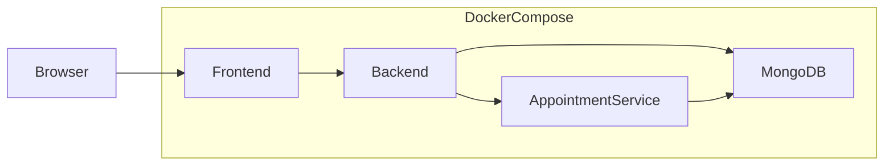

# Enterprise Hospital Management System

A production-oriented Hospital Management System that digitizes patient records, appointments, medical history, and staff workflows for doctors, nurses, and administrators.

This repository is built **incrementally**. Phase 1 establishes the monorepo foundation (workspaces, Docker Compose, environment templates). Application logic is added in later phases.

## Project Overview

The system replaces paper-based hospital workflows with a secure digital platform supporting:

- Patient management
- Medical records
- Appointment scheduling (independent microservice)
- Staff management with role-based access
- Dashboard analytics
- Containerized local development and Kubernetes-ready deployment

**Users:** Doctors, Nurses, Administrators

## Architecture



| Layer | Role |
|-------|------|
| React Frontend | Reception desk — UI for staff workflows |
| Backend API | Medical staff logic — auth, patients, records, dashboard |
| Appointment Service | Independent appointment department (scalable separately) |
| MongoDB | Patient archive and persistence |
| Docker / Kubernetes | Runtime and orchestration |

Services communicate over REST. No service may access another service’s database directly.

## Folder Structure

```
healthcare-system/
├── backend/                          # Express API (MVC) + production Dockerfile
├── frontend/                         # React + Vite client + NGINX Dockerfile
├── microservices/
│   └── appointment-service/          # Independent appointment API + Dockerfile
├── infra/
│   ├── docker-compose.yml            # Production-style local stack
│   └── .env.example                  # Compose variables (JWT, CORS, VITE_*)
├── scripts/
│   └── check-secrets.js              # Blocks tracked credential/.env files
├── .github/workflows/ci.yml          # Quality, E2E, Lighthouse, Docker builds
├── package.json                      # npm workspaces root
├── PROJECT_SPECIFICATION.md          # Authoritative project specification
└── README.md
```

## Technology Stack

| Area | Technology |
|------|------------|
| Frontend | React, Vite, React Router, Axios, TanStack Query |
| Backend | Node.js, Express, Mongoose, JWT, bcrypt, Helmet |
| Microservice | Independent Express appointment service |
| Database | MongoDB (local Docker / MongoDB Atlas) |
| Containers | Docker, Docker Compose |
| Orchestration | Kubernetes, Minikube, NGINX Ingress |
| Testing | Jest, Supertest, Playwright, Lighthouse CI |
| CI/CD | GitHub Actions |
| Cloud | Netlify (frontend), Vercel (backend), Atlas (DB) |

## Prerequisites

- [Node.js](https://nodejs.org/) 20 or later
- [npm](https://www.npmjs.com/) 10 or later (workspaces support)
- [Docker](https://www.docker.com/) and Docker Compose
- Git

## Installation

From the repository root:

```bash
npm install
```

npm workspaces install dependencies for `backend`, `frontend`, and `microservices/appointment-service` in one step.

## Environment Variables

Copy each example file and adjust values as needed. **Never commit `.env` files.**

```bash
cp backend/.env.example backend/.env
cp frontend/.env.example frontend/.env
cp microservices/appointment-service/.env.example microservices/appointment-service/.env
```

| Package | Key variables |
|---------|----------------|
| Backend | `PORT`, `JWT_SECRET`, `MONGODB_URI`, `APPOINTMENT_SERVICE_URL`, `CORS_ORIGINS` |
| Frontend | `VITE_API_URL`, `VITE_APPOINTMENT_URL` (build-time for Vite / Docker) |
| Appointment Service | `PORT`, `JWT_SECRET`, `MONGODB_URI`, `CORS_ORIGINS` |
| Compose (`infra/.env`) | `JWT_SECRET` (required), `CORS_ORIGINS`, `VITE_API_URL`, `VITE_APPOINTMENT_URL` |

**Docker networking:** containers talk via service names (`mongodb`, `appointment-service`, `backend`). Browser clients use host URLs (`localhost:5000` / `5001`) baked into the frontend image via Vite build args.

## Running with Docker

Images are multi-stage production builds (Node 20 Alpine APIs + unprivileged NGINX for the SPA). Compose requires a real `JWT_SECRET`.

```bash
cp infra/.env.example infra/.env
# Edit JWT_SECRET to a long random value before sharing the stack

npm run docker:up
```

Or:

```bash
docker compose -f infra/docker-compose.yml --env-file infra/.env up --build
```

Stop the stack:

```bash
npm run docker:down
```

### Production image architecture

| Image | Build | Runtime |
|-------|--------|---------|
| `backend` | `npm ci --workspace=backend --omit=dev` from root lockfile | Non-root Node, `GET /health` |
| `appointment-service` | Same pattern for appointment workspace | Non-root Node, `GET /health` |
| `frontend` | Vite production build with `VITE_*` **build args** | `nginxinc/nginx-unprivileged` on port **8080**, SPA `try_files`, `/health` |

Build a single image from the monorepo root:

```bash
docker build -f backend/Dockerfile -t healthcare-backend:local .
docker build -f microservices/appointment-service/Dockerfile -t healthcare-appointment:local .
docker build -f frontend/Dockerfile \
  --build-arg VITE_API_URL=http://localhost:5000 \
  --build-arg VITE_APPOINTMENT_URL=http://localhost:5001 \
  -t healthcare-frontend:local .
```

### Default ports

| Service | Host port | Container |
|---------|-----------|-----------|
| Frontend | 3000 | NGINX **8080** (unprivileged) |
| Backend | 5000 | 5000 |
| Appointment Service | 5001 | 5001 |
| MongoDB | 27017 | 27017 (published for local Compose; cloud lockdown later) |

Health checks gate startup order (`depends_on: condition: service_healthy`). After the stack is up, seed once from the host (Mongo published on `27017`):

```bash
npm run seed
# Login at http://localhost:3000/login — admin@hospital.local / Password123!
```

The backend Express app handles auth, patients, records, and dashboard stats (Phases 3–5). Appointments run as an independent microservice on port **5001** (Phase 6). The React frontend on port **3000** includes auth, role-aware CRUD for patients/records/appointments, optimistic booking, and Admin staff registration (Phases 7–8).

### Auth endpoints

| Method | Path | Access |
|--------|------|--------|
| `POST` | `/auth/login` | Public |
| `POST` | `/auth/logout` | Authenticated |
| `POST` | `/auth/register` | Admin (or first Admin bootstrap when DB has no users) |
| `GET` | `/auth/profile` | Authenticated |
| `PATCH` | `/auth/change-password` | Authenticated |

### Domain endpoints

| Method | Path | Access |
|--------|------|--------|
| `GET/POST` | `/patients` | All staff list; Admin/Doctor create |
| `GET/PUT/DELETE` | `/patients/:id` | All staff get; Admin/Doctor mutate |
| `PATCH` | `/patients/:id/status` | Admin, Doctor, Nurse |
| `GET/POST` | `/records` | All staff list; Admin/Doctor create |
| `GET/PUT/DELETE` | `/records/:id` | All staff get; Admin/Doctor mutate |
| `GET` | `/dashboard/statistics` | Admin, Doctor, Nurse |

### Appointment service (`:5001`)

| Method | Path | Access |
|--------|------|--------|
| `GET` | `/health` | Public |
| `GET/POST` | `/appointments` | Staff list; Admin/Doctor create |
| `GET` | `/appointments/doctor/:doctorId` | Admin, Doctor, Nurse |
| `GET` | `/appointments/patient/:patientId` | Admin, Doctor, Nurse |
| `GET/PUT/DELETE` | `/appointments/:id` | Staff get; Admin/Doctor mutate |
| `PATCH` | `/appointments/:id/status` | Admin, Doctor |

Send `Authorization: Bearer <token>` (from backend login) on protected routes. List endpoints support `page`, `limit`, `search`/`status` (patients), and `patientId` (records).

### Run locally

MongoDB must be running before the APIs start.

```bash
# Start MongoDB only
docker compose -f infra/docker-compose.yml up -d mongodb

cp backend/.env.example backend/.env
cp microservices/appointment-service/.env.example microservices/appointment-service/.env
cp frontend/.env.example frontend/.env
# Align JWT_SECRET in backend + appointment-service .env files
# Local URIs: MONGODB_URI=mongodb://localhost:27017/healthcare
# Backend: APPOINTMENT_SERVICE_URL=http://localhost:5001
# Frontend: VITE_API_URL=http://localhost:5000
#           VITE_APPOINTMENT_URL=http://localhost:5001

npm run start:backend
npm run start:appointment
npm run dev:frontend

# http://localhost:3000/login
curl http://localhost:5000/health
curl http://localhost:5001/health
```

### Seed data

With MongoDB running:

```bash
npm run seed
```

Creates 1 Admin, 3 Doctors, 2 Nurses, 20 Patients, 20 Medical Records, and 15 Appointments (collections are cleared first — safe to re-run).

| Email | Role | Password |
|-------|------|----------|
| `admin@hospital.local` | Admin | `Password123!` |
| `doctor1@hospital.local` … `doctor3@hospital.local` | Doctor | `Password123!` |
| `nurse1@hospital.local`, `nurse2@hospital.local` | Nurse | `Password123!` |

### Quality & security gates

```bash
npm run security:check        # reject tracked .env / credential files
npm run security:audit        # npm audit --omit=dev --audit-level=high
npm run lint                  # ESLint (backend, appointment-service, frontend, tests)
npm run build:frontend
npm test                      # backend + appointment-service Jest suites
```

### Tests

```bash
npm test                      # backend + appointment-service Jest suites
npm test --workspace=backend
npm run test:unit --workspace=backend
npm run test:integration --workspace=backend
```

#### End-to-end (Playwright)

First-time browser install:

```bash
npx playwright install chromium firefox webkit
```

E2E tests start an ephemeral MongoDB, seed data, and serve APIs + a production frontend preview on ports `3100` / `5100` / `5101` (so local `3000`/`5000` services are not disturbed):

```bash
npm run test:e2e             # Chromium, Firefox, WebKit
npm run test:e2e:headed      # headed debug mode
```

Expected coverage includes auth/RBAC smoke checks and the doctor clinical workflow (register patient → dashboard → book appointment → medical record → statistics).

#### Lighthouse CI

```bash
npm run lighthouse
```

Audits `/login` and authenticated `/dashboard` against thresholds: Performance ≥ 90, Accessibility ≥ 95, Best Practices ≥ 95 (SEO warned at ≥ 90). Reports write to `.lighthouseci/`.

### Continuous Integration (GitHub Actions)

Workflow: [`.github/workflows/ci.yml`](.github/workflows/ci.yml) — runs on pushes and pull requests to `main`.

| Job | What it does |
|-----|----------------|
| `quality` | `npm ci`, secret check, high-severity prod audit, ESLint, frontend build, Jest |
| `e2e` | Playwright Chromium/Firefox/WebKit against the ephemeral Mongo stack; uploads traces on failure |
| `lighthouse` | Authenticated `/login` + `/dashboard` audits; uploads `.lighthouseci/` even when assertions fail |
| `docker` | After all gates pass, Buildx builds the three images (**no registry push**) |

Permissions are read-only. Superseded runs are cancelled. CI uses throwaway test JWT/credentials and never echoes medical payloads.

### Troubleshooting (Docker / CI)

| Symptom | Likely fix |
|---------|------------|
| Compose fails with `JWT_SECRET must be set` | Copy `infra/.env.example` → `infra/.env` and set a secret |
| Frontend calls wrong API host | Rebuild frontend with correct `VITE_*` **build args** (not runtime env) |
| CORS blocked from browser | Set `CORS_ORIGINS=http://localhost:3000` (or your UI origin) in Compose env |
| Login fails after `docker:up` | Run `npm run seed` against `mongodb://localhost:27017/healthcare` |
| Image build pulls huge context | Ensure root `.dockerignore` excludes `node_modules`, `.env`, reports |
| Playwright/Lighthouse flaky locally | Stop other stacks on `3100`/`5100`/`5101`; re-run with a clean process tree |

## Development Roadmap

| Phase | Focus | Status |
|-------|--------|--------|
| **1** | Monorepo skeleton, workspaces, Docker Compose, env templates, README | Done |
| **2** | Backend foundation: Express, MVC folders, health, errors, logging | Done |
| **3** | Database models (User, Patient, MedicalRecord) | Done |
| **4** | Authentication & authorization (JWT, RBAC) | Done |
| **5** | Backend API: patients, records, dashboard | Done |
| **6** | Appointment microservice | Done |
| **7** | Frontend foundation (Vite, routing, auth, React Query) | Done |
| **8** | Frontend features (dashboards, CRUD UI, optimistic updates) | Done |
| **9** | Seed script, unit & integration tests | Done |
| **10** | E2E (Playwright), Lighthouse CI | Done |
| **11** | Production Dockerfiles, GitHub Actions | Done |
| **12** | Kubernetes manifests, Minikube | Next |
| **13** | Cloud deployment guides, API docs, real-time sync | Planned |

## Security Notes

- Secrets and connection strings come from environment variables only
- `.env` is gitignored; only `.env.example` templates are committed
- `npm run security:check` fails CI if real credential files are tracked
- User passwords are hashed with bcrypt on save; JWTs use `JWT_SECRET` / `JWT_EXPIRES_IN`
- CORS uses an allowlist via `CORS_ORIGINS` (never open CORS globally)
- API images run as non-root; frontend serves via unprivileged NGINX
- Production dependency audit gates high+ severities (`npm run security:audit`)

## License

Proprietary — all rights reserved unless otherwise stated.

## Contributing

1. Implement only the current approved phase
2. Follow the specification in `PROJECT_SPECIFICATION.md`
3. Do not merge failing CI builds (quality, E2E, Lighthouse, Docker)
4. Prefer small, reviewable changes over large dumps of unrelated code
