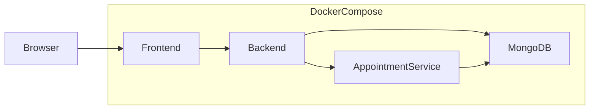

# Enterprise Hospital Management System

A production-oriented Hospital Management System that digitizes patient records, appointments, medical history, and staff workflows for doctors, nurses, and administrators.

This repository is built **incrementally**. Phase 1 establishes the monorepo foundation (workspaces, Docker Compose, environment templates). Application logic is added in later phases.

## Project Overview

The system replaces paper-based hospital workflows with a secure digital platform supporting:

- Patient management
- Medical records
- Appointment scheduling (independent microservice)
- Staff management with role-based access
- Dashboard analytics
- Containerized local development and Kubernetes-ready deployment

**Users:** Doctors, Nurses, Administrators

## Architecture



| Layer | Role |
|-------|------|
| React Frontend | Reception desk — UI for staff workflows |
| Backend API | Medical staff logic — auth, patients, records, dashboard |
| Appointment Service | Independent appointment department (scalable separately) |
| MongoDB | Patient archive and persistence |
| Docker / Kubernetes | Runtime and orchestration |

Services communicate over REST. No service may access another service’s database directly.

## Folder Structure

```
healthcare-system/
├── backend/                          # Express API (MVC)
├── frontend/                         # React + Vite client
├── microservices/
│   └── appointment-service/          # Independent appointment API
├── infra/
│   ├── docker-compose.yml            # Local multi-container stack
│   └── .env.example
├── package.json                      # npm workspaces root
├── PROJECT_SPECIFICATION.md          # Authoritative project specification
└── README.md
```

## Technology Stack

| Area | Technology |
|------|------------|
| Frontend | React, Vite, React Router, Axios, TanStack Query |
| Backend | Node.js, Express, Mongoose, JWT, bcrypt, Helmet |
| Microservice | Independent Express appointment service |
| Database | MongoDB (local Docker / MongoDB Atlas) |
| Containers | Docker, Docker Compose |
| Orchestration | Kubernetes, Minikube, NGINX Ingress |
| Testing | Jest, Supertest, Playwright, Lighthouse CI |
| CI/CD | GitHub Actions |
| Cloud | Netlify (frontend), Vercel (backend), Atlas (DB) |

## Prerequisites

- [Node.js](https://nodejs.org/) 20 or later
- [npm](https://www.npmjs.com/) 10 or later (workspaces support)
- [Docker](https://www.docker.com/) and Docker Compose
- Git

## Installation

From the repository root:

```bash
npm install
```

npm workspaces install dependencies for `backend`, `frontend`, and `microservices/appointment-service` in one step.

## Environment Variables

Copy each example file and adjust values as needed. **Never commit `.env` files.**

```bash
cp backend/.env.example backend/.env
cp frontend/.env.example frontend/.env
cp microservices/appointment-service/.env.example microservices/appointment-service/.env
```

| Package | Key variables |
|---------|----------------|
| Backend | `PORT`, `JWT_SECRET`, `MONGODB_URI`, `APPOINTMENT_SERVICE_URL` |
| Frontend | `VITE_API_URL` |
| Appointment Service | `PORT`, `JWT_SECRET`, `MONGODB_URI` |

**Docker networking:** inside Compose, use service names (`mongodb`, `appointment-service`), not `localhost`.

## Running with Docker

Start the full local stack (frontend, backend, appointment-service, MongoDB):

```bash
npm run docker:up
```

Or:

```bash
docker compose -f infra/docker-compose.yml up --build
```

Stop the stack:

```bash
npm run docker:down
```

### Default ports

| Service | Host port |
|---------|-----------|
| Frontend | 3000 |
| Backend | 5000 |
| Appointment Service | 5001 |
| MongoDB | 27017 |

The backend Express app is live in Phase 2 (`GET /health`). Frontend and appointment-service still use Phase 1 stubs until later phases.

### Run the backend locally

```bash
cp backend/.env.example backend/.env
npm run start:backend
# or with reload: npm run dev:backend
curl http://localhost:5000/health
```

## Development Roadmap

| Phase | Focus | Status |
|-------|--------|--------|
| **1** | Monorepo skeleton, workspaces, Docker Compose, env templates, README | Done |
| **2** | Backend foundation: Express, MVC folders, health, errors, logging | Done |
| **3** | Database models (User, Patient, MedicalRecord) | Next |
| **4** | Authentication & authorization (JWT, RBAC) | Planned |
| **5** | Backend API: patients, records, dashboard | Planned |
| **6** | Appointment microservice | Planned |
| **7** | Frontend foundation (Vite, routing, auth, React Query) | Planned |
| **8** | Frontend features (dashboards, CRUD UI, optimistic updates) | Planned |
| **9** | Seed script, unit & integration tests | Planned |
| **10** | E2E (Playwright), Lighthouse CI | Planned |
| **11** | Production Dockerfiles, GitHub Actions | Planned |
| **12** | Kubernetes manifests, Minikube | Planned |
| **13** | Cloud deployment guides, API docs, real-time sync | Planned |

## Security Notes

- Secrets and connection strings come from environment variables only
- `.env` is gitignored; only `.env.example` templates are committed
- Passwords will be hashed with bcrypt; JWTs will use `JWT_SECRET`
- CORS will use an allowlist (never open CORS globally)

## License

Proprietary — all rights reserved unless otherwise stated.

## Contributing

1. Implement only the current approved phase
2. Follow the specification in `PROJECT_SPECIFICATION.md`
3. Do not merge failing CI builds (CI arrives in a later phase)
4. Prefer small, reviewable changes over large dumps of unrelated code
