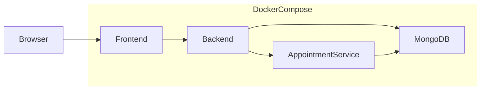
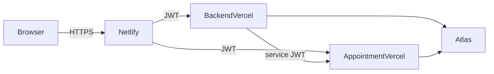

# Enterprise Hospital Management System

A production-oriented Hospital Management System that digitizes patient records, appointments, medical history, and staff workflows for doctors, nurses, and administrators.

This repository is built **incrementally**. Phase 1 establishes the monorepo foundation (workspaces, Docker Compose, environment templates). Application logic is added in later phases.

## Project Overview

The system replaces paper-based hospital workflows with a secure digital platform supporting:

- Patient management
- Medical records
- Appointment scheduling (independent microservice)
- Staff management with role-based access
- Dashboard analytics
- Containerized local development and Kubernetes-ready deployment

**Users:** Doctors, Nurses, Administrators

## Architecture

**Local (Docker Compose)**



**Cloud (Netlify + Vercel + Atlas)**



| Layer | Role |
|-------|------|
| React Frontend | Reception desk — UI for staff workflows (Netlify in cloud) |
| Backend API | Medical staff logic — auth, patients, records, dashboard (Vercel) |
| Appointment Service | Independent appointment department (separate Vercel project) |
| MongoDB | Patient archive — local Docker or **MongoDB Atlas** |
| Docker / Kubernetes | Local / cluster runtime and orchestration |

Services communicate over REST. No service may access another service’s database directly. The SPA uses TanStack Query **polling** (~15s) so lists and dashboard stats refresh across concurrent users without a manual reload.

## Folder Structure

```
healthcare-system/
├── backend/                          # Express API + Vercel adapter (api/) + Dockerfile
├── frontend/                         # React + Vite client + NGINX Dockerfile
├── microservices/
│   └── appointment-service/          # Appointment API + Vercel adapter + Dockerfile
├── docs/
│   ├── DEPLOYMENT.md                 # Netlify / Vercel / Atlas production guide
│   └── API.md                        # Full endpoint reference
├── infra/
│   ├── docker-compose.yml            # Production-style local stack
│   ├── .env.example                  # Compose variables (JWT, CORS, VITE_*)
│   └── k8s/                          # Minikube / Kubernetes manifests
├── scripts/
│   ├── check-secrets.js              # Blocks tracked credential/.env files
│   └── k8s/                          # TLS generation + kubectl apply helpers
├── .github/workflows/ci.yml          # Quality, E2E, Lighthouse, Docker builds
├── netlify.toml                      # Frontend Netlify build + SPA redirects
├── package.json                      # npm workspaces root
├── PROJECT_SPECIFICATION.md          # Authoritative project specification
└── README.md
```

## Technology Stack

| Area | Technology |
|------|------------|
| Frontend | React, Vite, React Router, Axios, TanStack Query |
| Backend | Node.js, Express, Mongoose, JWT, bcrypt, Helmet |
| Microservice | Independent Express appointment service |
| Database | MongoDB (local Docker / MongoDB Atlas) |
| Containers | Docker, Docker Compose |
| Orchestration | Kubernetes, Minikube, NGINX Ingress |
| Testing | Jest, Supertest, Playwright, Lighthouse CI |
| CI/CD | GitHub Actions |
| Cloud | Netlify (frontend), Vercel (backend), Atlas (DB) |

## Prerequisites

- [Node.js](https://nodejs.org/) 20 or later
- [npm](https://www.npmjs.com/) 10 or later (workspaces support)
- [Docker](https://www.docker.com/) and Docker Compose
- Git

## Installation

From the repository root:

```bash
npm install
```

npm workspaces install dependencies for `backend`, `frontend`, and `microservices/appointment-service` in one step.

## Environment Variables

Copy each example file and adjust values as needed. **Never commit `.env` files.**

```bash
cp backend/.env.example backend/.env
cp frontend/.env.example frontend/.env
cp microservices/appointment-service/.env.example microservices/appointment-service/.env
```

| Package | Key variables |
|---------|----------------|
| Backend | `PORT`, `JWT_SECRET`, `MONGODB_URI`, `APPOINTMENT_SERVICE_URL`, `CORS_ORIGINS` |
| Frontend | `VITE_API_URL`, `VITE_APPOINTMENT_URL` (build-time for Vite / Docker) |
| Appointment Service | `PORT`, `JWT_SECRET`, `MONGODB_URI`, `CORS_ORIGINS` |
| Compose (`infra/.env`) | `JWT_SECRET` (required), `CORS_ORIGINS`, `VITE_API_URL`, `VITE_APPOINTMENT_URL` |

**Docker networking:** containers talk via service names (`mongodb`, `appointment-service`, `backend`). Browser clients use host URLs (`localhost:5000` / `5001`) baked into the frontend image via Vite build args.

## Running with Docker

Images are multi-stage production builds (Node 20 Alpine APIs + unprivileged NGINX for the SPA). Compose requires a real `JWT_SECRET`.

```bash
cp infra/.env.example infra/.env
# Edit JWT_SECRET to a long random value before sharing the stack

npm run docker:up
```

Or:

```bash
docker compose -f infra/docker-compose.yml --env-file infra/.env up --build
```

Stop the stack:

```bash
npm run docker:down
```

### Production image architecture

| Image | Build | Runtime |
|-------|--------|---------|
| `backend` | `npm ci --workspace=backend --omit=dev` from root lockfile | Non-root Node, `GET /health` |
| `appointment-service` | Same pattern for appointment workspace | Non-root Node, `GET /health` |
| `frontend` | Vite production build with `VITE_*` **build args** | `nginxinc/nginx-unprivileged` on port **8080**, SPA `try_files`, `/health` |

Build a single image from the monorepo root:

```bash
docker build -f backend/Dockerfile -t healthcare-backend:local .
docker build -f microservices/appointment-service/Dockerfile -t healthcare-appointment:local .
docker build -f frontend/Dockerfile \
  --build-arg VITE_API_URL=http://localhost:5000 \
  --build-arg VITE_APPOINTMENT_URL=http://localhost:5001 \
  -t healthcare-frontend:local .
```

### Default ports

| Service | Host port | Container |
|---------|-----------|-----------|
| Frontend | 3000 | NGINX **8080** (unprivileged) |
| Backend | 5000 | 5000 |
| Appointment Service | 5001 | 5001 |
| MongoDB | 27017 | 27017 (published for local Compose; cloud lockdown later) |

Health checks gate startup order (`depends_on: condition: service_healthy`). After the stack is up, seed once from the host (Mongo published on `27017`):

```bash
npm run seed
# Login at http://localhost:3000/login — admin@hospital.local / Password123!
```

The backend Express app handles auth, patients, records, and dashboard stats (Phases 3–5). Appointments run as an independent microservice on port **5001** (Phase 6). The React frontend on port **3000** includes auth, role-aware CRUD for patients/records/appointments, optimistic booking, and Admin staff registration (Phases 7–8).

### Auth endpoints

| Method | Path | Access |
|--------|------|--------|
| `POST` | `/auth/login` | Public |
| `POST` | `/auth/logout` | Authenticated |
| `POST` | `/auth/register` | Admin (or first Admin bootstrap when DB has no users) |
| `GET` | `/auth/profile` | Authenticated |
| `PATCH` | `/auth/change-password` | Authenticated |

### Domain endpoints

| Method | Path | Access |
|--------|------|--------|
| `GET/POST` | `/patients` | All staff list; Admin/Doctor create |
| `GET/PUT/DELETE` | `/patients/:id` | All staff get; Admin/Doctor mutate |
| `PATCH` | `/patients/:id/status` | Admin, Doctor, Nurse |
| `GET/POST` | `/records` | All staff list; Admin/Doctor create |
| `GET/PUT/DELETE` | `/records/:id` | All staff get; Admin/Doctor mutate |
| `GET` | `/dashboard/statistics` | Admin, Doctor, Nurse |

### Appointment service (`:5001`)

| Method | Path | Access |
|--------|------|--------|
| `GET` | `/health` | Public |
| `GET` | `/appointments/stats/summary` | Admin, Doctor, Nurse |
| `GET/POST` | `/appointments` | Staff list; Admin/Doctor create |
| `GET` | `/appointments/doctor/:doctorId` | Admin, Doctor, Nurse |
| `GET` | `/appointments/patient/:patientId` | Admin, Doctor, Nurse |
| `GET/PUT/DELETE` | `/appointments/:id` | Staff get; Admin/Doctor mutate |
| `PATCH` | `/appointments/:id/status` | Admin, Doctor |

Send `Authorization: Bearer <token>` (from backend login) on protected routes. List endpoints support `page`, `limit`, `search`/`status` (patients), and `patientId` (records).

Full request/response examples, validation rules, and status codes: **[docs/API.md](docs/API.md)**.

### Run locally

MongoDB must be running before the APIs start.

```bash
# Start MongoDB only
docker compose -f infra/docker-compose.yml up -d mongodb

cp backend/.env.example backend/.env
cp microservices/appointment-service/.env.example microservices/appointment-service/.env
cp frontend/.env.example frontend/.env
# Align JWT_SECRET in backend + appointment-service .env files
# Local URIs: MONGODB_URI=mongodb://localhost:27017/healthcare
# Backend: APPOINTMENT_SERVICE_URL=http://localhost:5001
# Frontend: VITE_API_URL=http://localhost:5000
#           VITE_APPOINTMENT_URL=http://localhost:5001

npm run start:backend
npm run start:appointment
npm run dev:frontend

# http://localhost:3000/login
curl http://localhost:5000/health
curl http://localhost:5001/health
```

### Seed data

With MongoDB running:

```bash
npm run seed
```

Creates 1 Admin, 3 Doctors, 2 Nurses, 20 Patients, 20 Medical Records, and 15 Appointments (collections are cleared first — safe to re-run).

| Email | Role | Password |
|-------|------|----------|
| `admin@hospital.local` | Admin | `Password123!` |
| `doctor1@hospital.local` … `doctor3@hospital.local` | Doctor | `Password123!` |
| `nurse1@hospital.local`, `nurse2@hospital.local` | Nurse | `Password123!` |

### Quality & security gates

```bash
npm run security:check        # reject tracked .env / credential files
npm run security:audit        # npm audit --omit=dev --audit-level=high
npm run lint                  # ESLint (backend, appointment-service, frontend, tests)
npm run build:frontend
npm test                      # backend + appointment-service Jest suites
```

### Tests

```bash
npm test                      # backend + appointment-service Jest suites
npm test --workspace=backend
npm run test:unit --workspace=backend
npm run test:integration --workspace=backend
```

#### End-to-end (Playwright)

First-time browser install:

```bash
npx playwright install chromium firefox webkit
```

E2E tests start an ephemeral MongoDB, seed data, and serve APIs + a production frontend preview on ports `3100` / `5100` / `5101` (so local `3000`/`5000` services are not disturbed):

```bash
npm run test:e2e             # Chromium, Firefox, WebKit
npm run test:e2e:headed      # headed debug mode
```

Expected coverage includes auth/RBAC smoke checks and the doctor clinical workflow (register patient → dashboard → book appointment → medical record → statistics).

#### Lighthouse CI

```bash
npm run lighthouse
```

Audits `/login` and authenticated `/dashboard` against thresholds: Performance ≥ 90, Accessibility ≥ 95, Best Practices ≥ 95 (SEO warned at ≥ 90). Reports write to `.lighthouseci/`.

### Continuous Integration (GitHub Actions)

Workflow: [`.github/workflows/ci.yml`](.github/workflows/ci.yml) — runs on pushes and pull requests to `main`.

| Job | What it does |
|-----|----------------|
| `quality` | `npm ci`, secret check, high-severity prod audit, ESLint, frontend build, Jest |
| `e2e` | Playwright Chromium/Firefox/WebKit against the ephemeral Mongo stack; uploads traces on failure |
| `lighthouse` | Authenticated `/login` + `/dashboard` audits; uploads `.lighthouseci/` even when assertions fail |
| `docker` | After all gates pass, Buildx builds the three images (**no registry push**) |

Permissions are read-only. Superseded runs are cancelled. CI uses throwaway test JWT/credentials and never echoes medical payloads.

### Troubleshooting (Docker / CI)

| Symptom | Likely fix |
|---------|------------|
| Compose fails with `JWT_SECRET must be set` | Copy `infra/.env.example` → `infra/.env` and set a secret |
| Frontend calls wrong API host | Rebuild frontend with correct `VITE_*` **build args** (not runtime env) |
| CORS blocked from browser | Set `CORS_ORIGINS=http://localhost:3000` (or your UI origin) in Compose env |
| Login fails after `docker:up` | Run `npm run seed` against `mongodb://localhost:27017/healthcare` |
| Image build pulls huge context | Ensure root `.dockerignore` excludes `node_modules`, `.env`, reports |
| Playwright/Lighthouse flaky locally | Stop other stacks on `3100`/`5100`/`5101`; re-run with a clean process tree |

## Kubernetes Setup (Minikube)

Production-style orchestration lives in [`infra/k8s/`](infra/k8s/). Images are the Phase 11 production builds, loaded into Minikube’s Docker daemon (no registry).

### Architecture

| Resource | Detail |
|----------|--------|
| Namespace | `healthcare` |
| Frontend | 2 replicas, NGINX `:8080`, ClusterIP |
| Backend | 3 replicas, `:5000`, ClusterIP |
| Appointment | 2 replicas, `:5001`, ClusterIP Service name `appointment-service` |
| MongoDB | 1 replica + PVC, ClusterIP `mongodb` (in-cluster only) |
| Ingress | Host `hospital.local`, TLS secret `hospital-tls` |

**Ingress paths**

| Path | Backend | Notes |
|------|---------|--------|
| `/` | frontend:8080 | SPA |
| `/api` | backend:5000 | Rewritten to `/` (Express routes stay unprefixed) |
| `/appointments` | appointment-service:5001 | No rewrite |

**Frontend image must be rebuilt** for the cluster with:

- `VITE_API_URL=https://hospital.local/api`
- `VITE_APPOINTMENT_URL=https://hospital.local`

**Internal DNS:** backend uses `http://appointment-service:5001` and `mongodb://mongodb:27017/healthcare` from ConfigMap [`infra/k8s/configmap.yaml`](infra/k8s/configmap.yaml).

### Prerequisites

- [Minikube](https://minikube.sigs.k8s.io/docs/start/)
- `kubectl`
- Docker (Minikube driver)
- `openssl` (self-signed TLS)

### Deploy

```bash
# 1) Cluster + Ingress controller
minikube start
minikube addons enable ingress

# 2) Point Docker CLI at Minikube and build images into its daemon
eval $(minikube docker-env)          # PowerShell: minikube docker-env | Invoke-Expression

docker build -f backend/Dockerfile -t healthcare-backend:local .
docker build -f microservices/appointment-service/Dockerfile -t healthcare-appointment:local .
docker build -f frontend/Dockerfile \
  --build-arg VITE_API_URL=https://hospital.local/api \
  --build-arg VITE_APPOINTMENT_URL=https://hospital.local \
  -t healthcare-frontend:local .

# 3) Optional: override JWT (otherwise demo placeholder in app-secret.yaml is used)
export JWT_SECRET="$(openssl rand -hex 32)"

# 4) Apply manifests (ConfigMap, JWT Secret, TLS, Mongo, apps, Ingress)
npm run k8s:apply
# or: bash scripts/k8s/apply.sh

# 5) Map hospital.local → Minikube
# Linux/macOS:
echo "$(minikube ip) hospital.local" | sudo tee -a /etc/hosts
# Windows (Admin PowerShell):
# Add-Content -Path C:\Windows\System32\drivers\etc\hosts -Value "$(minikube ip) hospital.local"
```

TLS material is written to `infra/k8s/certs/` (gitignored). Recreate anytime with `npm run k8s:tls`.

### Verify

```bash
kubectl get pods,svc,ingress,secrets -n healthcare
kubectl get ingress -n healthcare
```

Confirm pods are `Running`, Services have ClusterIPs, Ingress has an ADDRESS, and secrets `healthcare-jwt` + `hospital-tls` exist.

```bash
# Frontend health (accept self-signed cert)
curl -k https://hospital.local/health

# Backend via /api rewrite
curl -k https://hospital.local/api/health
```

Open **https://hospital.local/login** in a browser (trust/continue past the self-signed warning).

### Seed data (Minikube)

Mongo is not published on the host. Port-forward, then seed:

```bash
kubectl port-forward -n healthcare svc/mongodb 27017:27017
# other terminal — use the same JWT as the cluster Secret if you call APIs with host tools
MONGODB_URI=mongodb://127.0.0.1:27017/healthcare npm run seed
```

Login: `admin@hospital.local` / `Password123!`

### Troubleshooting (Kubernetes)

| Symptom | Cause | Fix |
|---------|--------|-----|
| `ImagePullBackOff` | Image built on host Docker, not Minikube | `eval $(minikube docker-env)`, rebuild tags `healthcare-*:local`, restart pods |
| `DOCKER_HOST=…:2375` / Minikube can’t talk to Docker | Stale Docker TCP endpoint in the shell | `unset DOCKER_HOST` (Windows Docker Desktop: `export DOCKER_HOST=npipe:////./pipe/dockerDesktopLinuxEngine`), then `minikube start` / `eval $(minikube docker-env)` |
| NGINX 404 | Wrong Service name / hosts missing | Verify Ingress backends; ensure `hospital.local` → `minikube ip` in hosts file |
| Connection refused | Wrong port or Service DNS | `kubectl get svc -n healthcare`; backend→appointment must use `http://appointment-service:5001` |
| `minikube ip` times out (Windows Docker driver) | Host can’t route to the Minikube VM IP | `minikube tunnel` (admin), or `kubectl -n ingress-nginx port-forward svc/ingress-nginx-controller 8443:443` and open `https://hospital.local:8443` |
| CORS errors in browser | Origin not allowlisted | ConfigMap `CORS_ORIGINS` includes `https://hospital.local` |
| Frontend still calls localhost APIs | Image built without cluster VITE args | Rebuild frontend with `VITE_API_URL=https://hospital.local/api` |
| TLS / certificate errors | Secret missing or empty | `npm run k8s:tls`; `kubectl get secret hospital-tls -n healthcare` |

Tear down:

```bash
kubectl delete namespace healthcare
# optional: minikube stop
```

## Cloud Deployment (Netlify / Vercel / Atlas)

Step-by-step production guide (Atlas setup, dual Vercel APIs, Netlify SPA, env matrices, troubleshooting, screenshot placeholders):

→ **[docs/DEPLOYMENT.md](docs/DEPLOYMENT.md)**

**Live demo (Phase 13):**

| Layer | URL |
|-------|-----|
| Frontend (Netlify) | https://stately-sunflower-3fdd50.netlify.app |
| Backend API (Vercel) | https://backend-two-murex-65.vercel.app |
| Appointment API (Vercel) | https://appointment-service-phi.vercel.app |
| Database | MongoDB Atlas cluster `healthcare` (shared by both APIs) |

Login after seed: `admin@hospital.local` / `Password123!`

Quick outline:

1. Create MongoDB Atlas cluster + DB user + network access; seed with `MONGODB_URI=… npm run seed`
2. Deploy **appointment-service** Vercel project (`microservices/appointment-service`, `vercel.json`)
3. Deploy **backend** Vercel project (`backend`) with `APPOINTMENT_SERVICE_URL` pointing at step 2
4. Deploy **frontend** on Netlify (`netlify.toml`) with `VITE_API_URL` / `VITE_APPOINTMENT_URL`
5. Set `CORS_ORIGINS` on both APIs to the Netlify origin; redeploy APIs

Serverless adapters: `backend/api/index.js`, `microservices/appointment-service/api/index.js` (Docker/K8s still use `server.js`).  
Tip: if `vercel` install fails inside the npm workspaces tree, deploy from a standalone copy of the package directory (see deployment guide).

## API Documentation

Complete endpoint reference (auth, patients, records, dashboard, appointments):

→ **[docs/API.md](docs/API.md)**

## Real-time synchronization

Cross-user updates use **React Query polling** (`refetchInterval` 15s in `frontend/src/lib/query.js`), which the specification allows as an alternative to WebSockets and works with serverless Vercel. Mutations still invalidate caches immediately for the acting browser session.

## Development Roadmap

| Phase | Focus | Status |
|-------|--------|--------|
| **1** | Monorepo skeleton, workspaces, Docker Compose, env templates, README | Done |
| **2** | Backend foundation: Express, MVC folders, health, errors, logging | Done |
| **3** | Database models (User, Patient, MedicalRecord) | Done |
| **4** | Authentication & authorization (JWT, RBAC) | Done |
| **5** | Backend API: patients, records, dashboard | Done |
| **6** | Appointment microservice | Done |
| **7** | Frontend foundation (Vite, routing, auth, React Query) | Done |
| **8** | Frontend features (dashboards, CRUD UI, optimistic updates) | Done |
| **9** | Seed script, unit & integration tests | Done |
| **10** | E2E (Playwright), Lighthouse CI | Done |
| **11** | Production Dockerfiles, GitHub Actions | Done |
| **12** | Kubernetes manifests, Minikube | Done |
| **13** | Cloud deployment guides, API docs, real-time sync | Done |

## Future Improvements

- Horizontal Pod Autoscaler (HPA) and cert-manager on Kubernetes
- Registry push + GitOps continuous delivery for cloud clusters
- WebSocket/SSE event bus for lower-latency sync than polling
- OpenAPI/Swagger codegen from route validators
- Appointment service private networking (no public browser CORS when proxied)

## Credits

Built incrementally against `PROJECT_SPECIFICATION.md` as a learning-oriented enterprise hospital platform (Node.js, React, MongoDB, Docker, Kubernetes, Netlify, Vercel, Atlas).

## Security Notes

- Secrets and connection strings come from environment variables only
- `.env` is gitignored; only `.env.example` templates are committed
- `npm run security:check` fails CI if real credential files are tracked
- User passwords are hashed with bcrypt on save; JWTs use `JWT_SECRET` / `JWT_EXPIRES_IN`
- CORS uses an allowlist via `CORS_ORIGINS` (never open CORS globally)
- API images run as non-root; frontend serves via unprivileged NGINX
- Production dependency audit gates high+ severities (`npm run security:audit`)
- Minikube JWT lives in Secret `healthcare-jwt`; TLS in `hospital-tls` (keys never committed)

## License

Proprietary — all rights reserved unless otherwise stated.

## Contributing

1. Implement only the current approved phase
2. Follow the specification in `PROJECT_SPECIFICATION.md`
3. Do not merge failing CI builds (quality, E2E, Lighthouse, Docker)
4. Prefer small, reviewable changes over large dumps of unrelated code
